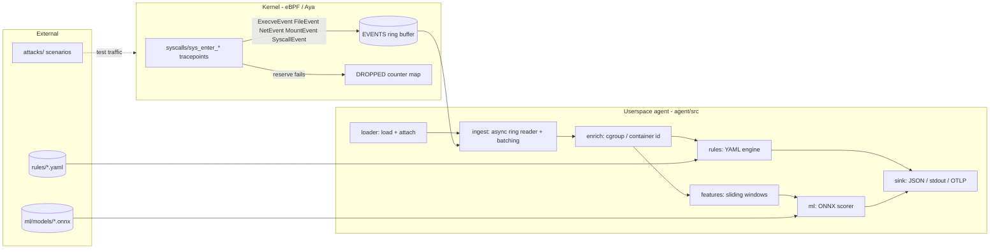

# Sentinel architecture

## Kernel side (`bpf/`)

* `bpf/common/` (`sentinel-common`) — the event ABI: `#[repr(C)]` structs
  shared verbatim with userspace. Every struct is 8-byte aligned and sized for
  a direct ring-buffer reservation (no BPF stack copies of big events).
* `bpf/src/syscalls.rs` — `execve`, `openat`, `connect`, `accept4`, `bind`,
  `ptrace`, `mount`, `setns` tracepoints (shared `parse_sockaddr`).
* `bpf/src/container.rs` — `unshare`, `capset`, `pivot_root` (escape signals).
* `bpf/src/network.rs` — `cgroup_skb` egress/ingress: per-cgroup byte
  counters (`BYTE_STATS`, keyed by `bpf_skb_cgroup_id`) and DNS query
  capture (UDP/53; raw wire-format QNAME, labels decoded in userspace so
  the probe stays at fixed-range copies).
* `bpf/src/util.rs` — maps (`EVENTS`, `DROPPED`, `CONFIG`), header fill,
  string reads, per-type emitters, uid-range filter (`should_capture`).

Design points:

* **Tracepoints first, CO-RE second.** `syscalls/sys_enter_*` works on any
  `CONFIG_FTRACE_SYSCALLS` kernel without BTF; CO-RE probes land in Phase 2
  where kernel structs are unavoidable.
* **Reserve-then-fill.** Events up to 600 bytes are written straight into
  ring-buffer memory; the 512-byte BPF stack only holds scalars.
* **Loss accounting.** A failed reservation bumps `DROPPED` instead of
  silently discarding — the benchmark's headline number.

## Userspace side (`agent/`)

| Module | Responsibility |
|---|---|
| `loader` | load the embedded eBPF object, attach probes, expose maps |
| `ingest` | async ring-buffer reads (`AsyncFd`), batch drain, decode |
| `event` | ABI decode → owned `Event` + field lookup for rules |
| `enrich` | cgroup → container id + pod UID; K8s API → pod name/namespace (cached) |
| `rules` | YAML rule files + boolean condition language |
| `features` | windowed per-process feature vectors (incl. DNS features) |
| `ml` | scorer trait: baseline heuristic, ONNX (`OnnxScorer`), LSTM (`SequenceScorer`) |
| `sink` | JSON-lines alerts/risk/tamper (stdout), metrics counters |
| `metrics` | Prometheus `/metrics` + `/healthz` (std TCP thread) |
| `tamper` | heartbeat/DROPPED/prog-id watchdog (Phase 5) |

Event flow per record: decode → enrich → rule evaluation (alerts) →
feature window → sinks. A window timer flushes feature vectors into risk
scores independent of the event stream.

## Data contracts

1. **Event ABI** — `bpf/common/src/lib.rs`, decoded by `agent/src/event.rs`.
   Size assertions in the common crate's tests guard against silent drift.
2. **Alert schema** — JSON envelope `{"kind":"alert","data":{...}}` with
   `schema_version` (currently 1).
3. **Feature vector** — `agent/src/features.rs` and `ml/datasets/collect.py`
   must stay in lockstep (column list is asserted in `ml/export/export_onnx.py`).

## Why Rust + Aya

* Kernel and userspace share one type system and one ABI crate — struct drift
  becomes a compile error, not a runtime misparse.
* The verifier-friendly patterns above are expressible directly (const-bounded
  slices, no C preprocessor).
* Upstreamability: fixes flow to `aya-rs/aya` (a stated goal of the project).
